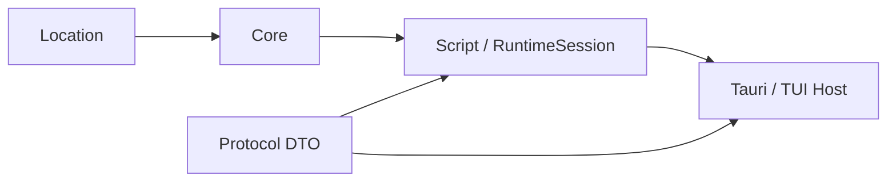

# 架构与阅读顺序

Narrava 将叙事语义与平台呈现分开。Core 决定状态和控制流，RuntimeSession 管理一局游戏的
命令事务，Host 执行平台操作并显示结果。Tauri 与 TUI 使用同一套游戏内容和运行规则。

## 依赖与数据流

箭头表示被依赖方到使用方。Protocol 不依赖 Core；Script 层负责 Core 与 Protocol 的转换。
Host 通过 `RuntimeCommand → RuntimeUpdate / PendingOperation` 驱动 Session，
不直接修改 State、Story 或 VM frame。

| 层 | 拥有的内容 | 说明 |
| --- | --- | --- |
| Core | 编译、Bytecode、VM、Engine、State、Story 与领域规则 | [编译](compiler.md)、[运行时](runtime.md) |
| Location | 地点、多边形、包含关系与位置校验 | [作者规则](../author/location.md) |
| Script | Boa、Oxc、脚本适配与 RuntimeSession | [执行事务](runtime.md) |
| Protocol | 命令、更新、节点、错误和不透明身份的纯数据 DTO | [宿主边界](hosts.md) |
| Host | 窗口或终端、输入、播放器、资源和文件 IO | [宿主实现](hosts.md) |

Core 不产生 DOM、CSS、ANSI 转义或播放器对象。跨线程和语言边界只传拥有型数据；
真实函数、Promise、执行帧和检查点留在其所属 Runtime。

## 按问题阅读

1. 源文件怎样成为可执行程序：[编译与表达式](compiler.md)。
2. 一个操作何时提交或回滚：[运行时与事务](runtime.md)。
3. Widget、局部域、Hook 和异步调用怎样执行：[Macro](macro-runtime.md)。
4. 如何恢复历史与随机进度：[Save 格式](save-format.md)。
5. 译文身份怎样跨编译和运行保留：[I18n](i18n.md)。
6. 如何将输出、弹窗和音频交给平台：[Host](hosts.md)。

源码定位见[开发指南](../development/README.md#源码入口)。
作者用法见[作者手册](../author/README.md)，实现缺口与设备验收见[项目状态](../development/status.md)。
