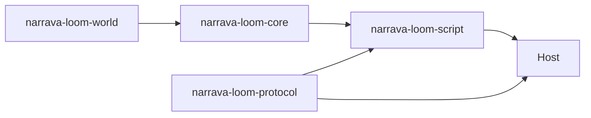

# 仓库布局与文件归属

本页规定源码、文档、示例和构建产物放在哪里。依赖方向与领域职责见
[总体架构](../architecture/overview.md)。

## 顶层目录

```text
Narrava Loom/
├── src/                            narrava-loom-core 源码与单元测试
├── hosts/
│   ├── audio.rs                   两个 Host 共用的本地音频输出
│   ├── tests/                     共享 Host 回归用例
│   ├── narrava-loom-tauri/         官方 Tauri Host；桌面可运行，移动共享层待平台工程
│   └── narrava-loom-tui/           Host-neutral 终端 Renderer 与输入前端
├── crates/
│   ├── narrava-loom-world/         纯领域地点、多边形与位置规则
│   ├── narrava-loom-protocol/      零 Core 依赖的拥有型 Runtime/Host DTO
│   └── narrava-loom-script/        ECMAScript 执行、RuntimeSession 与 Core/Protocol 适配
├── bindings/typescript/            游戏脚本 TypeScript 契约
├── editors/vscode-narrava-loom/    Twee 编辑器扩展源码
├── examples/                       唯一完整、无 Rust 的示例游戏
├── docs/                           作者、参考、架构与仓库开发文档
├── scripts/                        仓库级构建和打包入口
├── .github/workflows/              CI 与正式发行流水线
├── dist/                           可交付构建结果，不入库
└── target/                         Cargo 缓存，不入库
```

## 存放规则

- Core 公共语义、编译器和运行时放在 `src/`；不得导入 Tauri、DOM、CSS 或具体 Renderer 类型。
- World 算法放在独立 crate；Core 保留 State 所有权、Passage 绑定、历史与 Save 对接。
- 平台实现放在 `hosts/<host>/`，Host 以 `narrava-loom-protocol` 的拥有型命令与更新驱动 Runtime；
  Core 与 Protocol 之间的转换位于 `narrava-loom-script/src/protocol_adapter/`。
- 游戏作者可直接复制或修改的内容放在 `examples/`；示例不得要求作者编写 Rust。
- 游戏脚本签名在 `bindings/typescript/narrava.d.ts` 维护；生成的 DTO 与名称目录以 Protocol
  Rust 声明和 `bindings/script-contract.json` 为源，不手工编辑生成文件。
- 仓库操作脚本放在 `scripts/`；Host 内部的构建逻辑留在对应 Host crate。
- 教程放在 `docs/author/`，已实现契约放在 `docs/reference/`，设计理由放在
  `docs/architecture/`，仓库维护说明放在 `docs/development/`。
- `dist/` 只保存可分发结果，例如 `NarravaGame/` 和 `.vsix`；`target/` 只保存 Cargo 中间产物。
- `node_modules/`、Tauri `gen/`、本机配置和临时日志不得进入版本库。

## Rust 依赖方向



Core 不得依赖 Host 或具体 Renderer。Host 通过 Script Runtime 和 Protocol 驱动 Core。
World 只依赖序列化库，不依赖 Core、脚本或平台；三个宿主目标见[总体架构](../architecture/overview.md#宿主目标)。

## 构建输出

所有可交付文件统一写入 `dist/`：

```text
dist/
├── NarravaGame/
│   ├── narrava
│   ├── game.nar
│   ├── languages/
│   ├── resources/
│   ├── mods/
│   └── save/
└── vscode-narrava-loom/
    └── *.vsix
```

`dist/` 与 `target/` 都被忽略，但职责不同：删除 `target/` 只清理编译缓存；删除 `dist/` 会删除本地
发行结果。构建脚本不得把交付物放进源码目录。

## 新文件判断

新增文件前依次判断：

1. 它是否是既有领域算法或测试？放入所属 crate；Core 集成放入 `src/` 对应模块。
2. 它是否依赖具体平台？放入对应 `hosts/` 子目录。
3. 它是否供游戏作者直接使用？放入 `examples/` 或 `bindings/`。
4. 它是否解释现有行为？按读者放入 `docs/` 四个分区之一。
5. 它是否由命令生成？放入 `dist/`、`target/` 或工具约定的已忽略缓存目录。

不要在根目录建立临时计划、测试输出或重复 API 清单。
